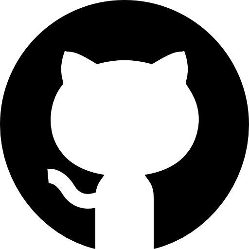

# Projeto Challenge Front-End 2º Semestre


## Integrantes

- [Ana Flavia Camelo - RM561489](https://github.com/afcamelo)
- [Gustavo Kenji Terada - RM562745](https://github.com/Gkenji110)
- [João Guilherme Carvalho Novaes - RM566234](https://github.com/JoaoGuiNovaes)


## Tecnologias

* **Frontend:** React, TypeScript, Tailwind CSS
* **Controle de versão:** Git / GitHub

## Imagens e Ícones





## Estrutura de pastas

<pre>
CHALLENGER-FRONT-END-2-SEM/
├── node_modules/
├── public/
│   ├── models/
│   ├── chat-bot-animate.svg
│   └── vite.svg
├── src/
│   ├── assets/
│   ├── components/
│   ├── pages/
│   ├── App.tsx
│   ├── index.css
│   ├── main.tsx
│   └── vite-env.d.ts
├── .gitignore
├── eslint.config.js
├── index.html
├── package-lock.json
├── package.json
├── README.md
├── tailwind.config.cjs
├── tsconfig.app.json
├── tsconfig.json
├── tsconfig.node.json
└── vite.config.ts
</pre>

## Como Rodar

1. Clone o repositório:

   ```bash
   git clone https://github.com/ChallengeAnaGuJoao/Challenge-front-end-3-sprint/
   ```
2. Acesse a pasta do projeto:

   ```bash
   cd challenger-front-end-3-sprint
   ```
3. Instale as dependências:

   ```bash
   npm install
   ```
4. Execute o projeto em modo de desenvolvimento:

   ```bash
   npm run dev
   ```
5. Abra o navegador em `http://localhost:5173` (ou a porta mostrada no terminal).

## Repositório

* **GitHub:** [https://github.com/ChallengeAnaGuJoao/Challenge-front-end-3-sprint/](https://github.com/ChallengeAnaGuJoao/Challenge-front-end-3-sprint/)

## Link youtube
https://www.youtube.com/watch?v=vE1QPvJ8KHw
